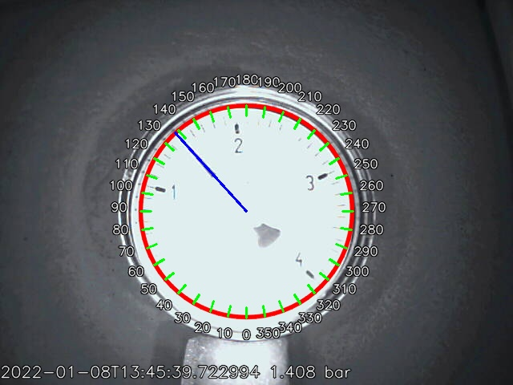
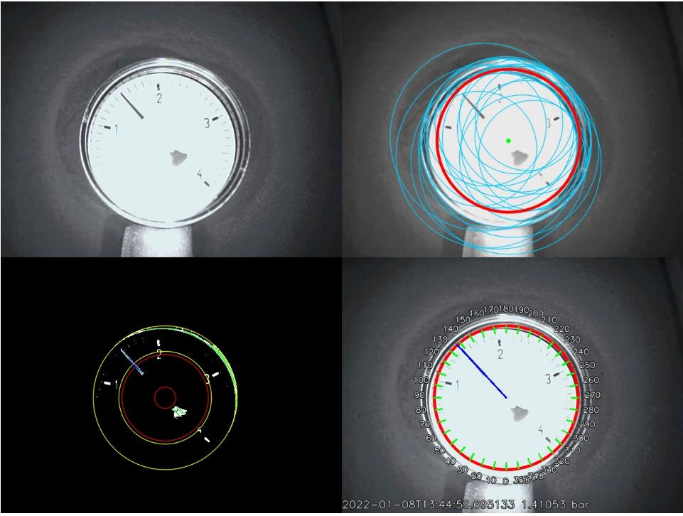

# Analog Gauge Reader
This project provides a service for reading images from an IP cam,
detecting lines and circles via Hough transform and produce a needle
position estimate.

Warning messages are sent via XMPP/Jabber when the readout values remain
outside a valid region or no successful readout was performed for too long.

Live results and a history is provided via built-in webserver with:

<http://localhost:8000>



<http://localhost:8000/debug>




Above images where produced with
```commandline
python3 -m analog_gauge_reader --url file://images/photo\*.jpg -d --settings-file etc/analog_gauge_reader/example_settings.txt 
```

## Hints
Lighting is a key for reliable detection.

* Direct light would be best since the shadow of the needle is then under the needle and do not produce fake detections.
* Direct light, however, might reflect in the protective glass.
* High contrast is important. Best is to have an overexposed image to have a clear separation between the usually dark needle and white dial.
* Blurriness of the image is of less importance.

### Autostart with systemd
Example systemd service files are provided in folder `etc/systemd/service`
The specified services take the escaped absolute path to the settings file as argument, e.g.
```
systemctl start analog_gauge_reader@$(systemd-escape /path/to/settings.txt)
systemctl enable analog_gauge_reader@$(systemd-escape /path/to/settings.txt)
```

## Requirements
Python 3.6+ and packages from `requirements.txt`

## Sources
The idea for this tool came from [1](https://medium.com/@nayak.abhijeet1/analogue-gauge-reader-using-computer-vision-62fbd6ec84cc)
and [2](https://github.com/intel-iot-devkit/python-cv-samples/tree/master/examples/analog-gauge-reader), 
where the principle is shown for a single image only.

## Non-features
Some features will not be added since they would add too much complexity:
* No mail is sent mail on warning: don't do that since its already logged and any decent logging facility, e.g. rsyslog can do that already
* Multiple notes for a single timestamp. Notes can be put in ms steps and can have a long text.

## Security
IP-cam authentication is done by query parameters in the URL. If an error occurs while requesting the image, the error
is logged and the credentials will appear in the log (every camera manufacturer uses different
query parameters, and it is out of scope of this module to filter out those credentials).
Therefore, ensure that permission to logs and camera are set as restrictive as possible.

